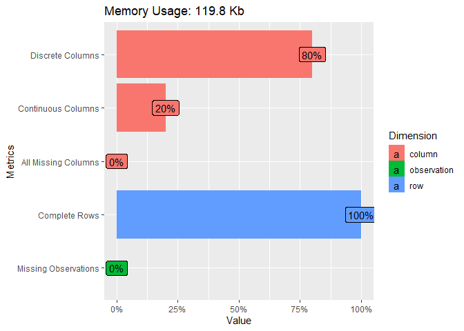
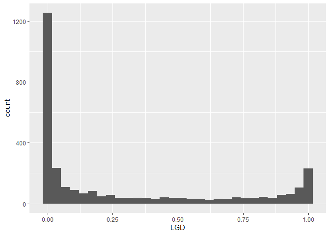
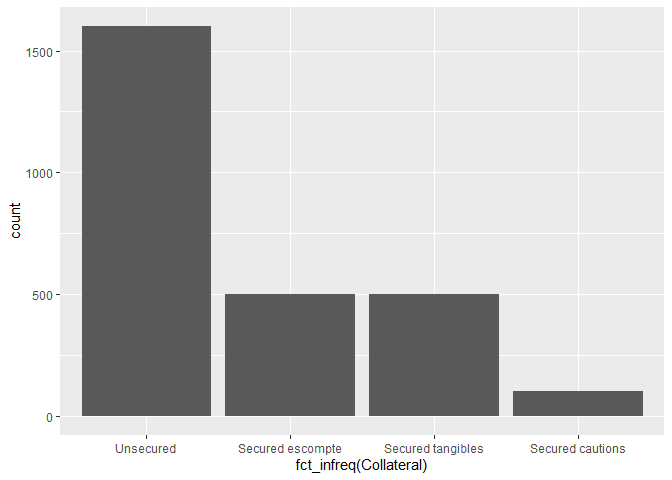
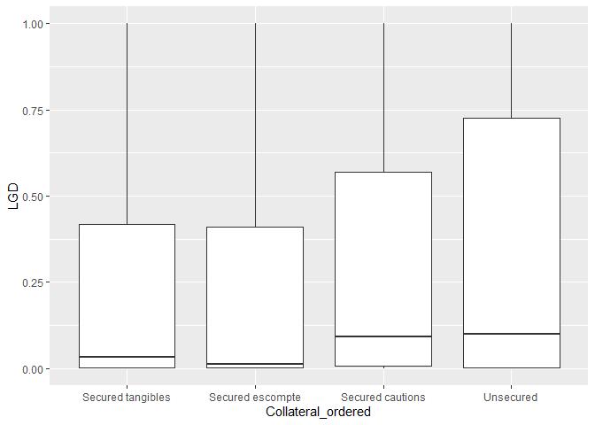
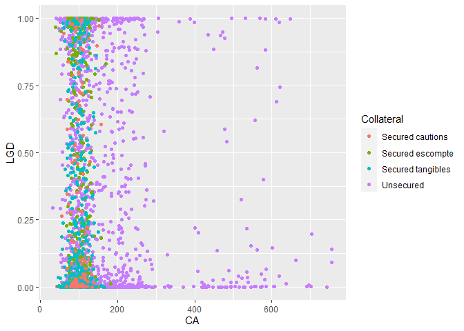
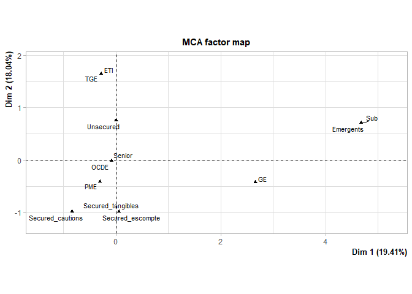
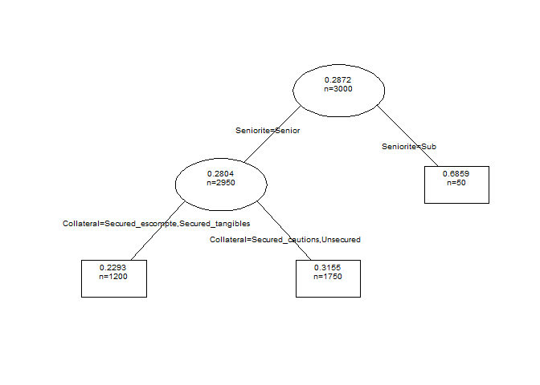

Atelier de modélisation de la LGD des actifs sains des entreprises
================
Pierre Clauss
Mars 2021

## Préambule

Je précise en préambule les 3 étapes nécessaires pour la réussite d’un
projet de data science :

1.  données : (i) importation, (ii) wrangling et (iii) visualisation (ou
    appelée encore *analyse exploratoire des données*)
2.  modélisation
3.  communication des résultats

Pour réaliser ces 3 étapes, l’association des langages R et Python peut
s’avérer très utile.

En effet, l’univers du package [**tidyverse**](https://r4ds.had.co.nz/)
est essentiel en R aujourd’hui pour l’exploration des données, les
packages [**scikit-learn**](https://scikit-learn.org/stable/) et
[**TensorFlow**](https://www.tensorflow.org/) n’ont pas leur équivalent
pour développer des algorithmes de machine et deep learning, et enfin la
communication des résultats via RMarkdown est très efficiente.

J’ajoute que R est complémentaire de Python pour l’étape de modélisation
dans l’évaluation des modèles utilisés (vérification des hypothèses
sous-jacentes par exemple).

Le package R [**reticulate**](https://rstudio.github.io/reticulate/)
permet ainsi de passer les data de R à Python (**r.data**) et de Python
à R (**py$data**).

``` r
library(tidyverse)
library(reticulate)
```

## 1 Données

### 1.1 Importation

J’importe les données à l’aide du package **readxl**, qui gère les
fichiers Excel parfaitement (décimales, pourcentages, valeurs
manquantes), avec la fonction `read_xlsx()`.

``` r
library(readxl)
(lgd <- read_xlsx("data_LGD.xlsx"))
```

    ## # A tibble: 3,000 x 5
    ##             LGD Seniorite Taille Collateral Pays 
    ##           <dbl> <chr>     <chr>  <chr>      <chr>
    ##  1 0.00106      Senior    PME    Unsecured  OCDE 
    ##  2 0.0000000514 Senior    PME    Unsecured  OCDE 
    ##  3 0.000487     Senior    PME    Unsecured  OCDE 
    ##  4 0.995        Senior    PME    Unsecured  OCDE 
    ##  5 0.972        Senior    PME    Unsecured  OCDE 
    ##  6 0.723        Senior    PME    Unsecured  OCDE 
    ##  7 0.0000000280 Senior    PME    Unsecured  OCDE 
    ##  8 0.00000191   Senior    PME    Unsecured  OCDE 
    ##  9 0.00792      Senior    PME    Unsecured  OCDE 
    ## 10 0.239        Senior    PME    Unsecured  OCDE 
    ## # ... with 2,990 more rows

Les données sont simulées à l’aide de lois Beta classiquement utilisées
pour modéliser le processus générateur des réalisations de LGD. En
effet, le fait stylisé de la LGD est la bimodalité de sa distribution de
probabilité (nous l’observerons dans l’étape visualisation) ce que
permet la loi Beta.

### 1.2 Wrangling

Le wrangling (*démêlage* en français) est plutôt simple sur des données
simulées et donc sans souci particulier.

Nous pouvons à l’aide du package **DataExplorer** obtenir un résumé des
données, données que l’on peut donc considérer comme **tidy**.

``` r
library(DataExplorer)
plot_intro(lgd)
```

<!-- -->

### 1.3 Visualisation

Une première viz est la distribution des LGD. Nous illustrons ainsi
ci-dessous le fait stylisé de la LGD à savoir sa bimodalité : dans un
processus de recouvrement suite à la défaillance d’une entreprise,
souvent, soit on récupère presque tout, soit on perd presque tout.

``` r
ggplot(data = lgd, aes(LGD)) +
  geom_histogram()
```

<!-- -->

Quelques premières statistiques et graphiques descriptifs nous
fournissent des informations sur les différences de LGD entre les
modalités des variables catégorielles.

``` r
lgd %>%
  group_by(Seniorite) %>%
  summarize(
    number = n(),
    mean = mean(LGD),
    median = median(LGD),
    min = min(LGD),
    max = max(LGD)
  )
```

    ## # A tibble: 2 x 6
    ##   Seniorite number  mean median      min   max
    ##   <chr>      <int> <dbl>  <dbl>    <dbl> <dbl>
    ## 1 Senior      2950 0.280 0.0497 3.80e-36  1.00
    ## 2 Sub           50 0.686 0.767  8.67e- 4  1.00

``` r
lgd %>%
  group_by(Taille) %>%
  summarize(
    number = n(),
    mean = mean(LGD),
    median = median(LGD),
    min = min(LGD),
    max = max(LGD)
  )
```

    ## # A tibble: 4 x 6
    ##   Taille number  mean  median      min   max
    ##   <chr>   <int> <dbl>   <dbl>    <dbl> <dbl>
    ## 1 ETI       500 0.341 0.138   1.22e-19  1.00
    ## 2 GE        300 0.408 0.250   1.63e-24  1.00
    ## 3 PME      2100 0.262 0.0355  3.80e-36  1.00
    ## 4 TGE       100 0.180 0.00406 1.34e-18  1.00

``` r
ggplot(
  data = lgd,
  mapping = aes(x = fct_infreq(Collateral))
) +
  geom_bar()
```

<!-- -->

``` r
Collateral_ordered <- fct_reorder(lgd$Collateral, lgd$LGD, mean)
ggplot(
  data = lgd, 
  mapping = aes(x = Collateral_ordered, y = LGD)
) +
  geom_boxplot()
```

<!-- -->

``` r
Pays_ordered <- fct_reorder(lgd$Pays, lgd$LGD, mean)
ggplot(
  data = lgd, 
  mapping = aes(x = Pays_ordered, y = LGD)
) +
  geom_boxplot()
```

<!-- -->

Après cette première visualisation, il est nécessaire d’aller plus loin
et de mobiliser une technique exploratoire plus puissante pour observer
précisément les similitudes entre modalités de variables. Nous allons
utiliser une technique d’apprentissage non supervisé de réduction de la
dimension : l’Analyse des Correspondances Multiples, puisque nous
n’avons que des variables catégorielles comme variables explicatives
de la LGD ; nous ajoutons cette dernière en variable illustrative.

``` r
library(FactoMineR)
res.MCA <- MCA(lgd, graph = F, quanti.sup = 1)
plot.MCA(res.MCA, invisible = c("ind"), col.var = 'black', cex = 0.7)
```

<!-- -->

Nous observons que les modalités *Sub* et *Emergents* sont éloignées des
autres modalités sur la première dimension. Sur la seconde dimension,
*TGE* et *ETI* s’opposent à *PME* et les modalités *secured* sont
proches et s’opposent à *unsecured*.

## 2 Modélisation

Pour choisir le bon type de modélisation, il faut tout d’abord savoir si
l’apprentissage est supervisé ou non. Dans le cas non supervisé, les
données ne sont pas labelisées et des méthodes de partitionnement ou
clustering (**k-means** par exemple) et de réduction de dimension
(**ACM** par exemple comme précédemment) peuvent être utilisées. Ici,
les données sont labélisées par la valeur de LGD. L’apprentissage est
donc supervisé. Reste à savoir si la famille de modèles est celle de la
**régression** (variable à expliquer quantitative) ou celle de la
**classification** (variable à expliquer qualitative). La LGD ayant des
valeurs quantitatives sur le support \[0,1\], nous pouvons pertinemment
utiliser des méthodes de régression.

Pour une illustration de ces choix, voici celle excellente proposée par
[**scikit-learn**](http://scikit-learn.org/stable/tutorial/machine_learning_map/index.html).

L’objectif est donc de trouver un modèle de régression qui permette de
prédire la valeur de LGD à partir de ses principaux features ou *risk
drivers*.

3 étapes sont définies pour la modélisation :

1.  séparation de l’échantillon en échantillon d’apprentissage et
    échantillon de test (75/25 classiquement)
2.  ajustement du modèle sur l’échantillon d’apprentissage suivant
    plusieurs méthodes possibles dans le cadre de la régression :
    régression linéaire, régularisée, arbre de décision, méthode
    ensembliste bagging ou boosting, etc.
3.  évaluation de la performance de la prédiction du modèle sur
    l’échantillon de test. Elle dépend du type de prédiction réalisée
    : soit une classe pour la classification, soit une valeur
    quantitative pour la régression. Pour la première, la matrice de
    confusion permet d’évaluer la performance de l’ajustement du modèle.
    Concernant la prédiction d’une valeur quantitative, le critère
    classique du *R²* permet d’en évaluer la performance.

### 2.1 Quelques évaluations d’algorithmes sous R

Sous R, le package **caret** me semble le plus complet car il appelle de
nombreux autres packages et propose avec sa fonction **train** de
[nombreux types de
modèles](http://topepo.github.io/caret/available-models.html). Je
précise que contrairement à Python (voir plus bas), si la variable est
de type *character* ou *logical*, R la transforme automatiquement en
type *factor* pour l’estimation.

``` r
library(caret)
set.seed(123)
sample_train <- lgd %>% sample_frac(0.75)
sample_test <- anti_join(lgd, sample_train)

knn_fit = train(LGD ~ ., data = sample_train, method = "knn")
knn_pred <- predict(knn_fit, sample_test)
postResample(pred = knn_pred, obs = sample_test$LGD)["Rsquared"]
```

    ##   Rsquared 
    ## 0.03402572

``` r
lm_fit = train(LGD ~ ., data = sample_train, method = "lm")
lm_pred <- predict(lm_fit, sample_test)
postResample(pred = lm_pred, obs = sample_test$LGD)["Rsquared"]
```

    ##  Rsquared 
    ## 0.0345636

``` r
ridge_fit = train(LGD ~ ., data = sample_train, method = "ridge")
ridge_pred <- predict(ridge_fit, sample_test)
postResample(pred = ridge_pred, obs = sample_test$LGD)["Rsquared"]
```

    ##   Rsquared 
    ## 0.03391932

``` r
lasso_fit = train(LGD ~ ., data = sample_train, method = "lasso")
lasso_pred <- predict(lasso_fit, sample_test)
postResample(pred = lasso_pred, obs = sample_test$LGD)["Rsquared"]
```

    ##   Rsquared 
    ## 0.03347767

``` r
tree_fit = train(LGD ~ ., data = sample_train, method = "rpart")
tree_pred <- predict(tree_fit, sample_test)
postResample(pred = tree_pred, obs = sample_test$LGD)["Rsquared"]
```

    ##   Rsquared 
    ## 0.02936675

``` r
rf_fit = train(LGD ~ ., data = sample_train, method = "rf")
rf_pred <- predict(rf_fit, sample_test)
postResample(pred = rf_pred, obs = sample_test$LGD)["Rsquared"]
```

    ##   Rsquared 
    ## 0.03437469

``` r
xgboost_fit = train(LGD ~ ., data = sample_train, method = "xgbLinear", objective = "reg:squarederror")
xgboost_pred <- predict(lm_fit, sample_test)
postResample(pred = xgboost_pred, obs = sample_test$LGD)["Rsquared"]
```

    ##  Rsquared 
    ## 0.0345636

### 2.2 Quelques évaluations d’algorithmes sous Python

A partir du package **scikit-learn**, nous testons quelques modèles de
régression. Précisons que nous avons besoin en Python d’encoder les
variables qualitatives en variables quantitatives pour pouvoir les
utiliser dans un modèle (contrairement à R).

Ces évaluations ne sont pas abouties puisque le *tuning* des
hyper-paramètres n’est pas réalisé et les hypothèses des modèles ne
sont pas vérifiées. L’objectif est de faire un premier pas dans la
modélisation et la prédiction de la LGD.

Nous pouvons observer la faiblesse de la performance des modèles : nous
y reviendrons lors de la conclusion.

``` python
import warnings
warnings.filterwarnings("ignore")

lgd_sklearn = r.lgd
import pandas as pd
for column in lgd_sklearn.columns:
 if lgd_sklearn[column].dtype == object:
  dummyCols = pd.get_dummies(lgd_sklearn[column])
  lgd_sklearn = lgd_sklearn.join(dummyCols)
  del lgd_sklearn[column]

from sklearn.model_selection import train_test_split
y = lgd_sklearn['LGD']
X = lgd_sklearn.drop(columns=['LGD'])
X_train, X_test, y_train, y_test = train_test_split(X, y, test_size=0.25, random_state=123)

from sklearn.neighbors import KNeighborsRegressor
knn = KNeighborsRegressor(n_neighbors=5).fit(X_train, y_train)
print("R2 knn: {:.4f}".format(knn.score(X_test, y_test)))
```

    ## R2 knn: -0.3119

``` python
from sklearn.linear_model import LinearRegression
lr = LinearRegression().fit(X_train, y_train)
print("R2 linear model: {:.4f}".format(lr.score(X_test, y_test)))
```

    ## R2 linear model: 0.0401

``` python
from sklearn.linear_model import Ridge
ridge = Ridge().fit(X_train, y_train)
print("R2 ridge: {:.4f}".format(ridge.score(X_test, y_test)))
```

    ## R2 ridge: 0.0393

``` python
from sklearn.linear_model import Lasso
lasso = Lasso().fit(X_train, y_train)
print("R2 lasso: {:.4f}".format(lasso.score(X_test, y_test)))
```

    ## R2 lasso: -0.0015

``` python
from sklearn.tree import DecisionTreeRegressor
tree = DecisionTreeRegressor().fit(X_train, y_train)
print("R2 tree: {:.4f}".format(tree.score(X_test, y_test)))
```

    ## R2 tree: 0.0397

``` python
from sklearn.ensemble import RandomForestRegressor
rf = RandomForestRegressor().fit(X_train, y_train)
print("R2 random forest: {:.4f}".format(rf.score(X_test, y_test)))
```

    ## R2 random forest: 0.0398

``` python
from sklearn.ensemble import GradientBoostingRegressor
gb = GradientBoostingRegressor().fit(X_train, y_train)
print("R2 gradient boosting: {:.4f}".format(gb.score(X_test, y_test)))
```

    ## R2 gradient boosting: 0.0397

### 2.3 Quelques évaluations d’algorithmes dans un environnement big data avec Apache Spark sous R

Avec le package R [**sparklyr**](https://therinspark.com/starting.html),
il est possible d’utiliser la librairie de fonctions de machine learning
[**MLlib**](https://spark.rstudio.com/mlib/). Cet exercice est purement
pédagogique étant donné que les données à notre disposition ne sont pas
de grande dimension.

``` r
library(sparklyr)
sc <- spark_connect(master = "local")
lgd_spark <- copy_to(sc, lgd, name = "lgd_spark")

partitions <- lgd_spark %>% sdf_random_split(training = 0.75, test = 0.25, seed = 123)
lgd_train <- partitions$train
lgd_test <- partitions$test

lm_model <- lgd_train %>% ml_linear_regression(LGD ~ .)
pred <- ml_predict(lm_model, lgd_test)
ml_regression_evaluator(pred, label_col = "LGD", metric_name = "r2")
```

    ## [1] 0.03886011

``` r
tree_model <- lgd_train %>% ml_decision_tree(LGD ~ .)
pred <- ml_predict(tree_model, lgd_test)
ml_regression_evaluator(pred, label_col = "LGD", metric_name = "r2")
```

    ## [1] 0.04019445

``` r
rf_model <- lgd_train %>% ml_random_forest_regressor(LGD ~ .)
pred <- ml_predict(rf_model, lgd_test)
ml_regression_evaluator(pred, label_col = "LGD", metric_name = "r2")
```

    ## [1] 0.03828117

``` r
gbt_model <- lgd_train %>% ml_gbt_regressor(LGD ~ .)
pred <- ml_predict(gbt_model, lgd_test)
ml_regression_evaluator(pred, label_col = "LGD", metric_name = "r2")
```

    ## [1] 0.03997056

## Pour conclure

Les *R²* ne révèlent pas des régressions très performantes. Néanmoins,
la LGD est un animal particulier. Vous pouvez revoir dans la section
data viz l’histogramme et la distribution bimodale de la LGD. Cette
bimodalité rend nécessairement difficile l’interprétation des *R²*.

Nous pouvons donc nous intéresser à la pertinence bancaire de la
partition en **risk drivers** de la LGD. Un arbre de régression par
exemple peut l’illustrer : en effet, l’arbre segmente les LGD en
fonction de leur séniorité et de la présence d’une sûreté solide ou non.

``` r
library(rpart)
arbre <- rpart(LGD ~ ., data = lgd)
plot(arbre, branch = .2, uniform = T, compress = T, margin = .1)
text(arbre, use.n = T, fancy = T, all = T, pretty = 0, cex = 0.6)
```

<!-- -->
